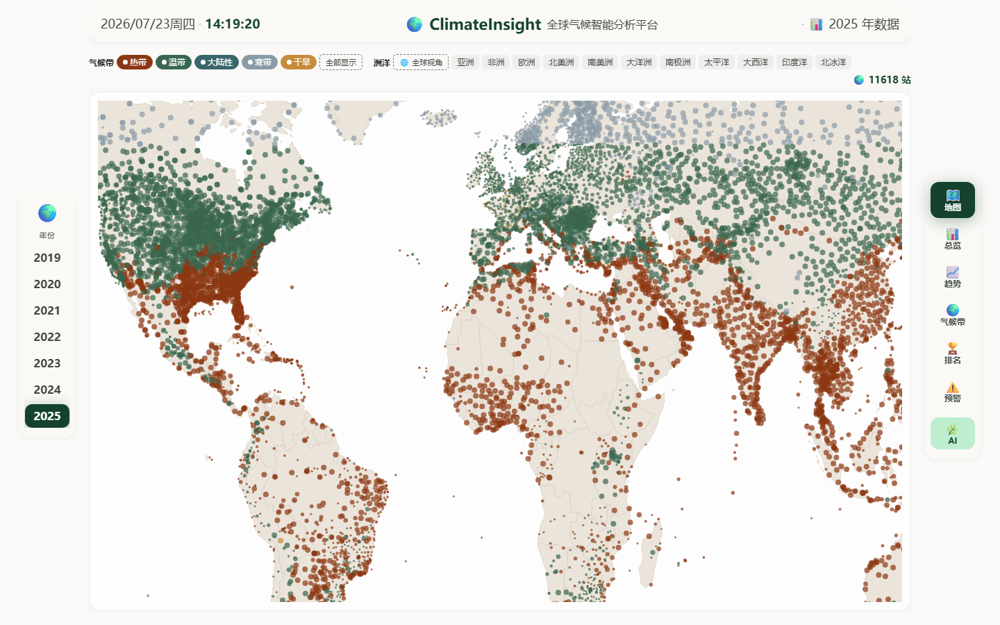

# 🌍 ClimateInsight — 全球气候智能分析平台

<p align="center">
  
</p>

<p align="center">
  <strong>基于 NOAA GSOD 全球气象数据 · 2015–2025 共 11 年 · ~12,000 气象站 · 153 万行数据</strong>
</p>

<p align="center">
  <a href="#-快速开始"></a>
  <a href="#-技术栈"></a>
  <a href="#-技术栈"></a>
  <a href="#-技术栈"></a>
  <a href="#-技术栈"></a>
  <a href="#-许可证"></a>
</p>

---

## 📖 目录

- [功能概览](#-功能概览)
- [快速开始](#-快速开始)
- [完整部署流程](#-完整部署流程)
- [技术栈](#-技术栈)
- [项目结构](#-项目结构)
- [系统架构](#-系统架构)
- [数据库设计](#-数据库设计)
- [API 参考](#-api-参考)
- [AI 分析助手](#-ai-分析助手)
- [前端页面](#-前端页面)
- [测试](#-测试)
- [数据来源](#-数据来源)
- [文档索引](#-文档索引)
- [许可证](#-许可证)

---

## 🎯 功能概览

| 页面 | 路径 | 功能描述 |
|---|---|---|
| 🗺️ **全球地图** | 首页 | ~12,000 气象站散点图，按气候带/大洲筛选，点击弹出站点详情 |
| 📊 **数据总览** | 首页 ↓ | 年度 KPI（全球均温/极端占比/最高温）+ 月度趋势图 + 排名 TOP15 |
| 📈 **温度趋势** | 首页 ↓ | 5 年滑动窗口 + 距平热力图 + 四季分组 + 洞察面板 |
| 🌍 **气候带** | 首页 ↓ | 5 气候带多图对比 + 详情卡片 + 多年演变（预聚合 0.01s） |
| 🏆 **站点排名** | 首页 ↓ | 最热/最冷/降水/极端 4 类 2×2 网格排名 |
| ⚠️ **极端预警** | 首页 ↓ | 四级风险评分（红/橙/黄/蓝）+ 月度极端事件 + 应对措施推荐 |
| 🌿 **AI 助手** | 右侧滑入 | 自然语言问答，17 类意图识别，自动生成图表 + 表格 |

### 交互特性

- **玻璃拟态 UI**：卡片 hover 浮起 + 斜角高光扫过
- **Grainient WebGL 背景**：动态噪点渐变动画
- **实时时钟 + 天气**：顶栏显示当前时间和 Open-Meteo 免费天气
- **AI 面板可拖拽**：400–500px 宽度，内容等比缩放
- **CSS scroll-snap**：整页滚动切换，平滑过渡
- **微交互**：导航脉冲光晕、按钮按压回弹、表格行 hover 高亮

---

## 🚀 快速开始

### 前置要求

- **Docker** ≥ 20.10 + **Docker Compose** ≥ 2.0
- 8 GB 可用内存
- 20 GB 可用磁盘空间（含数据）

### 3 步启动

```bash
# 1. 克隆项目
git clone https://github.com/wchenxu596-tech/ClimateInsight.git
cd ClimateInsight

# 2. 配置环境变量
cp .env.example .env
# 如需 AI 助手功能，编辑 .env 填入 DeepSeek API Key：
#   AGENT_ENABLED=true
#   LLM_API_KEY=sk-your-key-here

# 3. 一键启动
docker compose up -d
```

启动后访问 http://localhost:8080

> **注意**：Docker 镜像包含预置的 2015–2025 年数据。如需重新导入或添加新数据，参考 [完整部署流程](#-完整部署流程)。

---

## 📦 完整部署流程

以下是从零开始在**全新服务器或本地环境**上部署 ClimateInsight 的完整步骤。

### 环境要求

| 组件 | 最低版本 | 用途 |
|---|---|---|
| Docker | 20.10+ | 容器运行时 |
| Docker Compose | 2.0+ | 多容器编排 |
| Python | 3.11+ | 数据导入脚本 |
| Git | 2.30+ | 版本控制 |
| 磁盘空间 | 20 GB | MySQL 数据 + NOAA 原始文件 |
| 内存 | 8 GB | MySQL 缓冲池 + 应用 |

### 第一步：克隆项目

```bash
git clone https://github.com/wchenxu596-tech/ClimateInsight.git
cd ClimateInsight
```

### 第二步：配置环境

```bash
cp .env.example .env
```

编辑 `.env` 文件，关键配置项：

```ini
# ─── MySQL ───
MYSQL_HOST=mysql              # Docker 内部使用 mysql；外部连接用 127.0.0.1
MYSQL_PORT=3306               # 容器内端口
MYSQL_DATABASE=climate_dw
MYSQL_USER=climate_app
MYSQL_PASSWORD=climate123
MYSQL_ROOT_PASSWORD=climate123

# ─── 端口映射 ───
API_PORT=5000                 # 后端 API 端口
FRONTEND_PORT=8080            # 前端页面端口
MYSQL_PORT=3307               # MySQL 宿主机端口（避免与本地 MySQL 冲突）

# ─── AI Agent（可选）───
AGENT_ENABLED=false           # 设为 true 启用 LLM 意图识别
LLM_BASE_URL=https://api.deepseek.com/v1
LLM_API_KEY=                  # 填入你的 DeepSeek API Key
LLM_MODEL=deepseek-chat
```

### 第三步：启动服务

```bash
# 构建并启动所有容器
docker compose up -d

# 检查服务状态
docker compose ps
```

三个容器应全部显示 `healthy`：

| 容器 | 端口 | 说明 |
|---|---|---|
| `climate_mysql` | 3307→3306 | MySQL 8.0 数据库 |
| `climate_backend` | 5000 | Flask + Gunicorn API |
| `climate_frontend` | 8080 | Nginx + Vue 3 前端 |

### 第四步：导入数据

数据导入支持两种模式：

**模式 A：从 NOAA 下载原始数据（推荐，全自动）**

```bash
# 安装 Python 依赖
pip install pymysql

# 导入指定年份（自动下载 tar.gz → 解压 → ETL → 聚合 → MySQL）
python scripts/download_and_load.py --year 2025

# 批量导入所有年份（2015-2025）
python scripts/import_all_years.py
```

**模式 B：使用已有 tar.gz 文件**

```bash
# 将 NOAA GSOD tar.gz 文件放入 data/raw/ 目录
# 格式：2015.tar.gz, 2016.tar.gz, ...

# 跳过下载，直接导入
python scripts/download_and_load.py --year 2024 --skip-download
```

**模式 C：仅导入预置测试数据**

```bash
# 导入单年示例数据（包含在 sql/mysql/ 中）
docker compose exec mysql mysql -uroot -pclimate123 climate_dw < sql/mysql/001_init.sql
```

导入过程输出示例：

```
[2025] Downloading... https://www.ncei.noaa.gov/.../2025.tar.gz
[2025] Extracting 12741 station files...
[2025] ETL: 3,720,000 rows → dws_station_monthly (11618 stations)
[2025] ADS: kpi=4, monthly=12, ranking=60, zones=5, zone_trends=5, stations=11618
[MySQL] 2025 done (45.2s)
```

### 第五步：验证

```bash
# 健康检查
curl http://localhost:5000/api/health

# 查询 2025 年全球均温
curl "http://localhost:5000/api/kpi?year=2025"

# 运行测试
cd backend && python -m pytest ../tests/ -v
```

浏览器访问 http://localhost:8080 ，应看到全球气象站地图。

### 故障排除

| 问题 | 解决方案 |
|---|---|
| 端口冲突 | 修改 `.env` 中的 `API_PORT`/`FRONTEND_PORT`/`MYSQL_PORT` |
| MySQL 启动失败 | `docker compose down -v && docker compose up -d` 清除旧数据卷 |
| 数据导入 GBK 错误 | Windows 下设置 `PYTHONIOENCODING=utf-8` |
| AI 助手无响应 | 确保 `.env` 中 `AGENT_ENABLED=true` 且 `LLM_API_KEY` 有效 |
| 页面空白 | 检查 `docker compose ps` 确认所有容器 healthy |

---

## 🏗️ 技术栈

| 层级 | 技术 | 说明 |
|---|---|---|
| **数据源** | NOAA GSOD 2015–2025 | 全球地面逐日观测，~100 MB/年压缩 |
| **数据管道** | Python 3.11 + pymysql | 提取→清洗→聚合→加载，一站式脚本 |
| **数据集市** | MySQL 8.0 | DWS（站×月明细）+ 6 张 ADS 预聚合表 |
| **后端 API** | Flask 3.1 + Gunicorn | RESTful，14 个数据端点 + AI Agent 端点 |
| **缓存** | Flask 内存缓存 (@cached) | 300s TTL，response 级缓存 |
| **前端** | Vue 3.5 + Vite 8 + ECharts 6 + Element Plus | SPA，玻璃拟态 Biophilic 设计 |
| **背景** | @bg-effects/grainient | WebGL 动态噪点渐变 |
| **容器化** | Docker + Docker Compose | MySQL + Backend + Frontend 三容器编排 |
| **AI 引擎** | DeepSeek API + 规则引擎 | 双引擎意图识别，自动回退 |
| **天气** | Open-Meteo Free API | 顶栏实时气温（无需 API Key） |

---

## 📂 项目结构

```
ClimateInsight/
│
├── backend/                        # Flask API 后端
│   ├── agent/                      #   AI 分析助手引擎
│   │   ├── intents.py              #     意图识别（LLM + 规则双引擎，17 类意图）
│   │   ├── prompts.py              #     LLM System Prompt + JSON Schema
│   │   ├── service.py              #     编排层（意图→工具→响应）
│   │   ├── tools.py                #     8 个参数化 SQL 工具
│   │   ├── responder.py            #     多段落分析 + 表格 + 图表生成
│   │   ├── schemas.py              #     AnalysisPlan 结构化分析合约
│   │   ├── catalog.py              #     DatasetCatalog 数据白名单
│   │   ├── planner.py              #     LLM Function Calling + 规则回退
│   │   ├── statistics.py           #     统计分析（线性回归/Z-score/滑动平均）
│   │   ├── alerts_engine.py        #     预警规则引擎（5 条预置规则）
│   │   └── chart_spec.py           #     ChartSpec 图表映射
│   ├── routes/
│   │   ├── dashboard.py            #     KPI / 月度 / 气候带（3 端点）
│   │   ├── rankings.py             #     排名 / 趋势 / 气候带趋势（8 端点）
│   │   ├── alert.py                #     预警 / 地图站点 / 站点详情（4 端点）
│   │   ├── agent.py                #     AI 问答 v1 + v2 端点
│   │   ├── ai.py                   #     AI 相关辅助路由
│   │   └── health.py               #     健康检查
│   ├── cache.py                    #   @cached(ttl) 装饰器
│   ├── app.py                      #   Flask 入口 + CORS + Blueprint 注册
│   ├── config.py                   #   集中配置（环境变量）
│   ├── db.py                       #   PyMySQL 连接池
│   ├── requirements.txt            #   Python 依赖
│   └── Dockerfile
│
├── frontend/                       # Vue 3 前端
│   ├── src/
│   │   ├── views/
│   │   │   ├── StationMap.vue      #     全球地图（气候带/大洲筛选 + 站点弹窗跟随）
│   │   │   ├── Dashboard.vue       #     数据总览（KPI + 月度 + TOP15）
│   │   │   ├── TrendAnalysis.vue   #     温度趋势（5年窗口 + 距平热力图 + 洞察面板）
│   │   │   ├── CityRanking.vue     #     站点排名（4类 2×2 网格）
│   │   │   ├── ClimateZones.vue    #     气候带（8:2 多图 + 卡片 + 演变）
│   │   │   ├── AlertDashboard.vue  #     极端预警（风险分级 + 月度事件 + 应对措施）
│   │   │   └── StationDetail.vue   #     站点详情（月度温度 + 极端事件日历）
│   │   ├── components/
│   │   │   ├── AIPanel.vue         #     AI 对话面板（拖拽宽度 + 快捷提问 + 图表渲染）
│   │   │   ├── AppTopNav.vue       #     顶栏（实时时钟 + 天气 + 品牌）
│   │   │   ├── RightNav.vue        #     右侧导航（6 页 + AI 按钮）
│   │   │   ├── HomePage.vue        #     主页容器（scroll-snap + KeepAlive）
│   │   │   ├── GlassCard.vue       #     玻璃拟态卡片
│   │   │   ├── ChartPanel.vue      #     图表包装器（自适应缩放）
│   │   │   └── PageState.vue       #     加载/错误/空状态
│   │   ├── composables/
│   │   │   └── useDashboardTheme.js#     ECharts 主题（配色/tooltip/grid）
│   │   ├── styles/
│   │   │   ├── tokens.css          #     设计 tokens（颜色/阴影/缓动/动画）
│   │   │   └── base.css            #     全局布局（三栏栅格/玻璃卡片/scroll-snap）
│   │   ├── api/index.js            #     API 客户端（前端缓存30s + 请求去重）
│   │   └── router/index.js         #     Vue Router
│   ├── Dockerfile
│   ├── nginx.conf                  #   Nginx 反向代理配置
│   └── vite.config.js
│
├── scripts/                        # 数据管道脚本
│   ├── download_and_load.py        #   一站式：下载→ETL→聚合→MySQL
│   ├── import_all_years.py         #   批量导入（遍历 data/raw/*.tar.gz）
│   ├── verify_data.py              #   数据质量校验
│   └── setup.sh                    #   一键环境准备
│
├── sql/mysql/                      # 数据库 DDL
│   ├── 001_init.sql                #   初始化建表（DWS + ADS）
│   ├── 002_create_users.sql        #   创建应用账户 + 权限
│   └── 003_ads_year_keys.sql       #   ADS 主键优化
│
├── tests/                          # 测试套件（43/43 通过）
│   ├── test_agent_intents.py       #   意图识别（17 类 + 边界）
│   ├── test_agent_tools.py         #   工具安全（SQL 注入防护）
│   ├── test_api.py                 #   API 端点
│   ├── test_etl_quality.py         #   数据质量
│   ├── test_v2_schema.py           #   v2 AnalysisPlan 校验
│   ├── test_v2_security.py         #   v2 SQL 注入防护
│   └── test_v2_statistics.py       #   统计分析函数
│
├── docs/                           # 项目文档
│   ├── 01-AI分析助手技术文档.md      #   AI 助手完整技术说明
│   ├── 02-AI升级实施手册.md          #   AI 升级操作手册
│   ├── 03-升级基线审计.md            #   升级前基线审计
│   ├── 04-升级测试报告.md            #   43 项测试报告
│   ├── 05-数据字典.md               #   数据库表/字段说明
│   ├── 06-最终交付手册.md            #   交付验收手册
│   ├── 07-部署运行手册.md            #   部署运维指南
│   └── 08-项目架构总览.md            #   架构设计文档
│
├── image/                          # 截图资源
│   └── screenshot-map.png          #   全球地图页
│
├── docker-compose.yml              # 三容器编排
├── .env.example                    # 环境变量模板
├── .gitignore
└── README.md                       # 本文件
```

---

## 🏛️ 系统架构

```
┌──────────────────────────────────────────────────────────────┐
│                    数据管道 (Python)                          │
│                                                              │
│  NOAA GSOD tar.gz  ──→  解压 CSV  ──→  清洗 ETL              │
│        │                      │              │                │
│   ~100MB/年             ~370万行/年     去极值/标准化          │
│                                                              │
└──────────────────────────────────┬───────────────────────────┘
                                   │
                                   ▼
┌──────────────────────────────────────────────────────────────┐
│                   MySQL 8.0 数据集市                          │
│                                                              │
│  ┌─────────────────────────────────────┐                    │
│  │  DWS: dws_station_monthly           │  153 万行           │
│  │  (station_id, year, month, 21 cols) │  站×月明细           │
│  └──────────────┬──────────────────────┘                    │
│                 │ 预聚合                                      │
│     ┌───────────┼───────────┬──────────┬──────────┐         │
│     ▼           ▼           ▼          ▼          ▼         │
│  ads_kpi    ads_monthly  ads_ranking ads_zones ads_zone_    │
│  (4×11)     (12×11)      (60×11)    (5×11)    trends       │
│                                                 (5×11)      │
│  ┌──────────┐                                              │
│  │ads_stations│  133,954 行（地图/预警极速查询）             │
│  └──────────┘                                              │
└──────────────────────────────────┬───────────────────────────┘
                                   │
                                   ▼
┌──────────────────────────────────────────────────────────────┐
│                Flask + Gunicorn API                          │
│                                                              │
│  @cached(300s) ← 内存缓存                                    │
│  14 个 REST 端点  +  AI Agent v1/v2                          │
│  参数化 SQL (100% %s 占位符)  ← SQL 注入防护                 │
└──────────────────────────────────┬───────────────────────────┘
                                   │
                                   ▼
┌──────────────────────────────────────────────────────────────┐
│              Nginx + Vue 3 前端                               │
│                                                              │
│  Grainient WebGL 背景                                        │
│  ECharts 6 图表渲染                                          │
│  Element Plus UI 组件                                        │
│  3 列栅格布局 (80px | 1fr | 80px)                            │
│  CSS scroll-snap 页面切换                                     │
│  前端 API 缓存 (30s + 请求去重)                               │
└──────────────────────────────────────────────────────────────┘
```

### 数据流

```
用户请求 → @cached(300s) 命中?
  ├── 命中 → 直接返回缓存
  └── 未命中 → ADS 预聚合表 (0.01–0.15s)
                └── 回退到 DWS 聚合 (0.9s, 仅数据导入时)
```

---

## 🗄️ 数据库设计

### 四层架构

| 层级 | 表前缀 | 说明 | 行数 |
|---|---|---|---|
| **ODS** | — | NOAA GSOD 原始 CSV（不在 MySQL 中） | ~370 万行/年 |
| **DWD** | — | 轻度清洗后的日数据（不在 MySQL 中） | ~370 万行/年 |
| **DWS** | `dws_station_monthly` | 站×月聚合（21 字段） | 153 万行 |
| **ADS** | `ads_*` | 应用层预聚合（6 张表） | 133K+ 行 |

### ADS 预聚合表

| 表 | 粒度 | 查询速度 | 用途 |
|---|---|---|---|
| `ads_kpi` | 年×指标 | <1ms | 全球 KPI 总览 |
| `ads_monthly_trend` | 年×月 | <1ms | 月度温度趋势 |
| `ads_ranking` | 年×类别×排名 | <1ms | 4 类站点排名 |
| `ads_zones` | 年×气候带 | <1ms | 气候带站点分布 |
| `ads_zone_trends` | 年×气候带 | <1ms | 气候带温度/降水/极端 |
| `ads_stations` | 年×站 | ~0.15s | 地图散点 + 预警风险 |

### 关键索引

```sql
-- DWS 层
PRIMARY KEY (station_id, year, obs_month)
INDEX idx_year_sid (year, station_id)        -- 站级聚合加速
INDEX idx_climate_zone (year, climate_zone)   -- 气候带聚合加速
INDEX idx_temp_max (year, avg_temp_max)       -- 极端温度查询加速

-- ADS 层
PRIMARY KEY (data_year, ...)                  -- 所有 ADS 表
```

---

## 🌐 API 参考

所有接口前缀：`http://localhost:5000`

### 数据 API

| 接口 | 参数 | 说明 | 缓存 |
|---|---|---|---|
| `GET /api/kpi` | `year` | KPI 指标（均温/站点数/极端占比/最高温） | 300s |
| `GET /api/monthly` | `year` | 12 个月均温/最高/最低 | 300s |
| `GET /api/zones` | `year` | 5 气候带站点数 | 300s |
| `GET /api/ranking` | `year, category, limit` | 排名 TOP N（hottest/coldest/rainiest/most_extreme） | 300s |
| `GET /api/trend` | `year` | 月度温度原始数据 | 300s |
| `GET /api/trend/multi-year` | `years` | 多年月度趋势（逗号分隔，最多5年） | 300s |
| `GET /api/zones/trend` | `years` | 气候带多年趋势（预聚合，~0.01s） | 300s |
| `GET /api/trend/kpi-history` | `years` | 多年 KPI 历史 | 300s |
| `GET /api/stations` | `year` | 全球气象站概要（预聚合，~0.15s） | 300s |
| `GET /api/stations/detail` | `station_id, year` | 单站月度详情 | — |
| `GET /api/alert/risk` | `year, limit` | 极端风险评分 + 四级预警 | 300s |
| `GET /api/alert/monthly` | `year` | 月度极端事件聚合（热浪/寒潮/极端/雷暴） | 300s |

### AI Agent API

```bash
# v1: 兼容旧接口
curl -X POST http://localhost:5000/api/agent/query \
  -H "Content-Type: application/json" \
  -d '{"question":"这些年变暖了多少？","year":2025,"page":"trend"}'

# 返回格式
{
  "code": 0,
  "data": {
    "answer": "🌡️ 2015–2025 年全球温度趋势分析\n...",
    "intent": "trend_analysis",
    "table": { "columns": [...], "rows": [...] },
    "chart": { "type": "line", "x": [...], "y": [...] }
  }
}
```

```bash
# v2: 分析计划预览
curl -X POST http://localhost:5000/api/v2/analysis/plan \
  -H "Content-Type: application/json" \
  -d '{"question":"热带和温带哪个更热？"}'

# v2: 数据集目录
curl http://localhost:5000/api/v2/catalog
```

---

## 🤖 AI 分析助手

ClimateInsight 内置 AI 分析助手，支持自然语言查询全球气候数据。

### 架构

```
用户问题 → 意图识别（LLM优先 → 规则回退）
         → 工具调用（8个参数化SQL工具）
         → 响应生成（多段落分析 + 图表 + 表格）
```

### 17 类意图

| 意图 | 示例问题 | 返回内容 |
|---|---|---|
| `kpi` | "全球平均气温？" | KPI 指标表 |
| `monthly` | "各月温度变化？" | 月度折线图 |
| `ranking` | "最热的5个站点？" | 排名表 + 柱状图 |
| `zones` | "气候带分布？" | 站点数饼图 |
| `trend_analysis` | "这些年变暖了多少？" | 多年趋势分析 |
| `compare` | "2023和2024哪个更热？" | 年际对比 |
| `seasonal` | "哪个季节最热？" | 四季分析 |
| `zone_detail` | "哪个气候带升温最快？" | 气候带温度趋势 |
| `extremes` | "极端事件增加了吗？" | 极端事件趋势 |
| `station_query` | "VOSTOK站的数据" | 站点详情 |
| `page_analysis` | "分析当前页面" | 页面综合解读 |
| `help` | "怎么用？" | 使用指南 |
| `chat` | "你好" | 自我介绍 |
| `unknown` | — | 引导提示 |

### 快捷提问

每个页面有 4–5 个动态快捷提问，根据当前页面和年份自动切换。例如：

- **总览页**："2025年最热的是哪里？""各月温度变化？"
- **预警页**："评估2025年预警""极端事件变化趋势""温度异常检测""哪个气候带极端事件最多？"

### 安全措施

- DatasetCatalog 白名单（仅允许访问 ADS 表）
- 100% 参数化 SQL（%s 占位符，无字符串拼接）
- SQL 关键词拦截（DROP/DELETE/INSERT/SELECT/EXEC 等）
- 问题长度限制 500 字符

详见 [docs/01-AI分析助手技术文档.md](docs/01-AI分析助手技术文档.md)

---

## 🎨 前端页面

### 页面布局

```
┌─────────────────────────────────────────────────┐
│  AppTopNav (时钟 + 天气 + ClimateInsight)        │
├──────┬──────────────────────────────┬───────────┤
│      │                              │           │
│ 左   │     HomePage                 │  右       │
│ 侧   │     (scroll-snap 6 页)       │  侧       │
│ 栏   │                              │  导       │
│      │  ┌──────────────────────┐   │  航       │
│ 80px │  │  当前页面内容         │   │  80px     │
│      │  │  (ECharts + 表格)    │   │           │
│      │  └──────────────────────┘   │  ① 地图   │
│      │                              │  ② 总览   │
│      │                              │  ③ 趋势   │
│      │                              │  ④ 气候带 │
│      │                              │  ⑤ 排名   │
│      │                              │  ⑥ 预警   │
│      │                              │  🌿 AI   │
├──────┴──────────────────────────────┴───────────┤
│  AI Panel (右侧滑入，400-500px 可拖拽)           │
└─────────────────────────────────────────────────┘
```

### 设计系统

- **主色调**：Biophilic 青绿 `#3a674f`（`--ci-primary`）
- **辅色**：深青 `#39656b`、暖橙 `#8b3713`
- **玻璃效果**：`rgb(255 255 255 / 70%)` + `backdrop-filter: blur(12px)`
- **过渡缓动**：`cubic-bezier(0.16, 1, 0.3, 1)`（标准）/ `cubic-bezier(0.34, 1.56, 0.64, 1)`（弹性）
- **动画**：pulse-glow（3s 呼吸）、shimmer（光泽扫过）、fade-up（淡入上浮）

---

## 🧪 测试

```bash
# 全部测试（43 项）
cd backend && python -m pytest ../tests/ -v

# 单项测试
python -m pytest ../tests/test_agent_intents.py -v   # 意图识别（17 类）
python -m pytest ../tests/test_agent_tools.py -v     # 工具安全
python -m pytest ../tests/test_api.py -v             # API 端点
python -m pytest ../tests/test_etl_quality.py -v     # 数据质量
python -m pytest ../tests/test_v2_schema.py -v       # v2 Schema 校验
python -m pytest ../tests/test_v2_security.py -v     # v2 安全
python -m pytest ../tests/test_v2_statistics.py -v   # 统计函数
```

测试报告详见 [docs/04-升级测试报告.md](docs/04-升级测试报告.md)

---

## 🌐 数据来源

**NOAA Global Summary of the Day (GSOD)**

全球约 12,000 个气象站的每日观测数据，包含温度、降水、气压、风速、极端天气事件等 28 个字段。

| 属性 | 值 |
|---|---|
| 数据源 | NOAA NCEI |
| 时间范围 | 2015–2025（11 年） |
| 站点数 | ~12,000（年际有变化） |
| 原始格式 | tar.gz 内包含站点级 CSV |
| 年数据量 | ~100 MB 压缩 / ~3.7 GB 解压 |
| 官网 | https://www.ncei.noaa.gov/data/global-summary-of-the-day/archive/ |

---

## 📚 文档索引

| 文档 | 说明 |
|---|---|
| [01-AI分析助手技术文档](docs/01-AI分析助手技术文档.md) | AI 助手架构、意图体系、安全措施 |
| [02-AI升级实施手册](docs/02-AI升级实施手册.md) | AI 升级操作步骤 |
| [03-升级基线审计](docs/03-升级基线审计.md) | 升级前基线记录 |
| [04-升级测试报告](docs/04-升级测试报告.md) | 43 项测试结果 |
| [05-数据字典](docs/05-数据字典.md) | 数据库表结构、字段说明 |
| [06-最终交付手册](docs/06-最终交付手册.md) | 交付验收清单 |
| [07-部署运行手册](docs/07-部署运行手册.md) | 部署运维指南 |
| [08-项目架构总览](docs/08-项目架构总览.md) | 系统架构设计 |

---

## 📄 许可证

MIT License

Copyright (c) 2025 ClimateInsight

---

<p align="center">
  <sub>Built with ❤️ using Vue 3 · Flask · MySQL · ECharts · Docker</sub>
</p>
